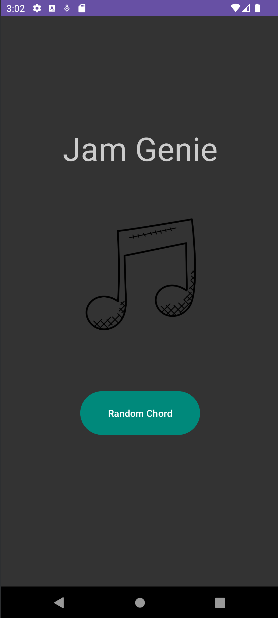

# Jam Genie

<div align="center">
  <p align="center">
    
  </p>
</div>

## Overview

JamGenie is a simple Android app developed with the goal of learning Android development. The app serves as a useful tool for musicians by providing random chord generation for music practice. The project focuses on hands-on experience in Android app development using Kotlin and Android Studio.

## Functionalities

1. Random Chord Generation:
    - Generate random chords for music practice.
    - Display chord information.

(maybe more to come)

## Tools Used

- **Programming Language**: Kotlin
- **IDE**: Android Studio

## Getting Started

1. Clone the repository:
```sh
git clone git@github.com:SimaoGato/jam-genie.git
```

2. Open in Android Studio:
    - Open Android Studio.
    - Choose "Open an existing Android Studio project" and select the cloned repository.

3. Run on Emulator or Device:
    - Set up an Android emulator or connect a physical device.
    - Click on the "Run" button in Android Studio to install and run the app.

## License

[](https://opensource.org/licenses/MIT)

This project is licensed under the [MIT License](LICENSE). Feel free to use, modify, and distribute the code for your learning or personal projects.
